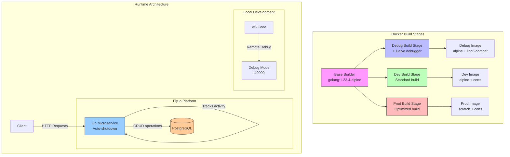

# POC Fly Microservice

A prototype Go microservice demonstrating Fly.io deployment with scale-to-zero capabilities.

## Features
- REST API with Postgres backend
- Auto-shutdown after 5 minutes of inactivity
- Scale-to-zero configuration for both service and database
- Flat package design for simplicity
- Remote debugging support with Delve

## Prerequisites
- Go 1.21 or later
- Docker and Docker Compose
- [Task](https://taskfile.dev) for development automation
- Fly.io CLI (for deployment)

## Development

Start the development environment:
```bash
task dev
```

### Available Tasks
```bash
task                 # Show available tasks
task dev             # Start development environment
task dev:down        # Stop development environment
task dev:clean       # Clean development environment (removes volumes)
task health          # Check service health
task create:item     # Create a new item (requires name argument)
task list:items      # List all items
```

### Example Usage
```bash
# Start the development environment
task dev

# In another terminal:
# Create a new item
task create:item -- "Test Item"

# List all items
task list:items

# Check service health
task health
```

### Debugging

The application runs with Delve debugger enabled. You can connect to it using your IDE:

#### VS Code
Add the following configuration to your `.vscode/launch.json`:
```json
{
    "version": "0.2.0",
    "configurations": [
        {
            "name": "Connect to Docker",
            "type": "go",
            "request": "attach",
            "mode": "remote",
            "remotePath": "/app",
            "port": 40000,
            "host": "127.0.0.1"
        }
    ]
}
```

#### GoLand
1. Go to Run -> Edit Configurations
2. Add New Configuration -> Go Remote
3. Set the following:
   - Host: `localhost`
   - Port: `40000`
   - Path mappings: 
     - Local: `$PROJECT_DIR$`
     - Remote: `/app`

## Architecture



## API Endpoints

- `GET /health` - Health check endpoint
- `POST /items` - Create a new item
- `GET /items/` - List all items

### Request Examples

Create Item:
```json
POST /items
{
    "name": "Example Item"
}
```

## Local Development

The development environment uses Docker Compose with hot-reload capabilities. The service will automatically rebuild when changes are detected.

## Deployment
```bash
fly deploy
